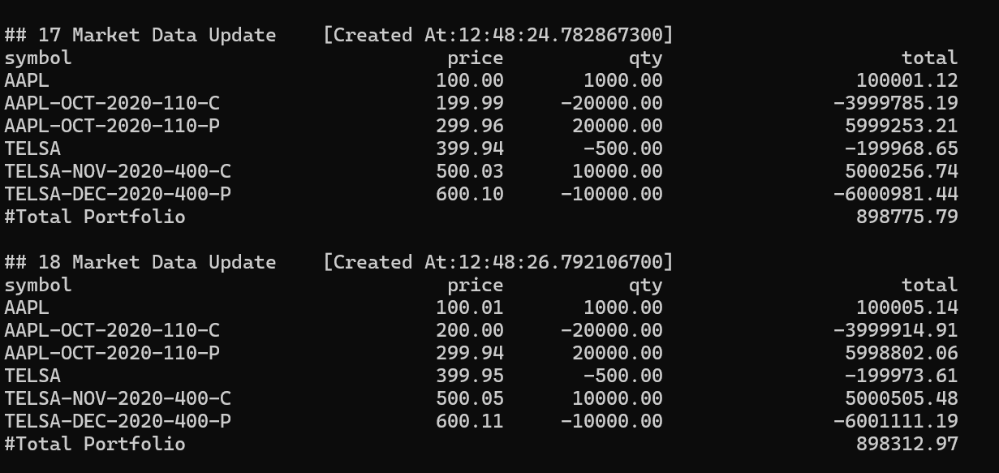
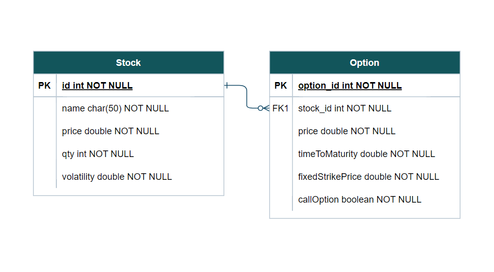
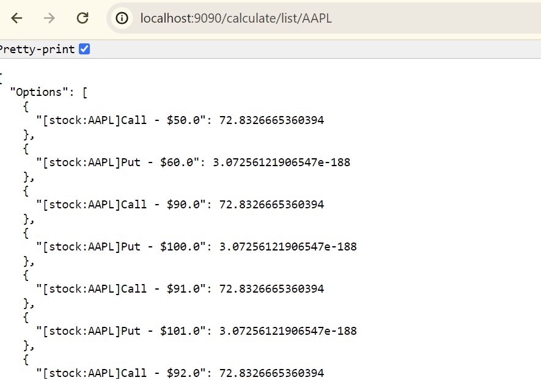

# redesigned-octo-spoon
A real time market data simulator with publisher and subscriber included to process mock stock data price changes and their effect on its dependent call and put options. The updated prices are based on brownian motion, a commonly used model for explaining behaviour of changing prices of financial assets.

## Section 1: Market Data Update


## Tech Stack
- Springboot
- H2 Database

## Design Considerations
- Stocks are stored in stocks.csv file and are read and updated in database when app starts running.
- Scheduled market update every 2 seconds while app is running 
- Decoupled design: Two event types were used to process market update when stock prices were changed in database. This processed calculations are formatted as a string and passed to new event which prints data. This allows each event type to have separation of concerns and handle what they need to. These methods can be expanded in the future and allows for scaling codebase in the future.
- Java Streams were used instead of Lists to speed up data processing as it allows for lazy evaluation and parallelization when certain computer standards are met.
- Stock and Option have the following relationships as shown in this ERD diagram and are modelled in the app as such:



## Running locally

#### Install dependencies
- Java
- Gradle

#### Starting Game
1. Open project and open a terminal in folder.
 
2. Start app by running ```gradle run```. This will install all dependencies and run app.

## Section 2: Real Time Option Value Calculation 

This calculation is done based on European Option Pricing Formula.



### Getting a Calculation

1. Toggle to your favourite browser and browse "http://localhost:9090/calculate/list/AAPL" to get the real time calculations for all options associated with the stock with the ticker "AAPL". A sample output can be seen above.


### Design Considerations:
- Since each option is associated with a single stock and a stock can have multiple options,  
- ImmutablePair Java type was used for storing results of option and its real time price. This is to allow for safer typing and with no list mutations involved, immutable types will be processed faster than mutable types. Immutable types also less memory intensive and better for processing large amounts of options. 
- Error handling for stocks not found as shown below:


## Section 3: Java Documentation

1. Run ```./gradlew javadoc``` in terminal to start documentation generation.

2. Codebase Documentation for app found at path "app/build/docs/javadoc"


## To Dos:
- [x] Utilising Browninan motion to simulate market data changes
- [x] Processing data with publisher and subscriber
- [x] Printing data updates 
- [ ] Plotly Dashboard to visualise data
- [ ] 

References:
- https://medium.com/@albertoglvz25/brownian-motion-for-stock-market-prediction-in-python-aae5bb755e85#:~:text=The%20Geometric%20Brownian%20Motion%20(GBM,are%20random%20and%20normally%20distributed. for understanding brownian motion and its possible relation to certain price changes of financial assets

[](https://cyberbeam524.github.io/redesigned-octo-spoon/javadoc/)